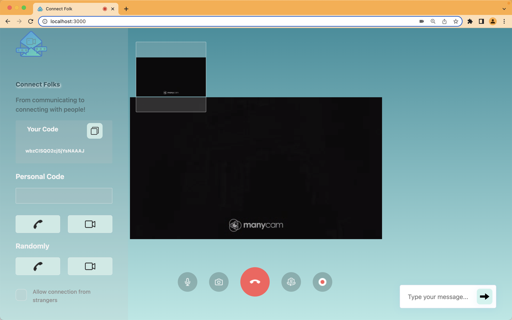

# Connect Folks ☏

#### From communicating to connecting with people!



Connect Folks is a web-based calling application, a person can share a personal-code to someone who he wants to chat or video-call.

## Features

#### Person 1 = P1 and Person 2 = P2

- when P1 shares code to P2 then P2 can make a chat or video call to P1.
- P1 can accepts or rejects the call
- If P1 accepts the call then both can:
- - Mute/Unmute the video
- - Mute/Unmute the voice
- - Screen Sharing
- - Recording (start/pause/stop)
- - Chat

## Technologies

Connect Folks Web App uses a number of open source projects to work properly:

- WebRTC
- Socket io
- Node.js
- Express
- JavaScript
- HTML
- CSS

## Installation

Connect Folks requires [Node.js](https://nodejs.org/) to run on machine.
Clone this project
Install the dependencies.

```sh
cd connect-folks
npm i
node app
```

**Connect with your favourite people**
